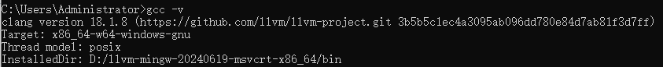
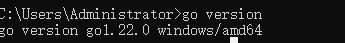
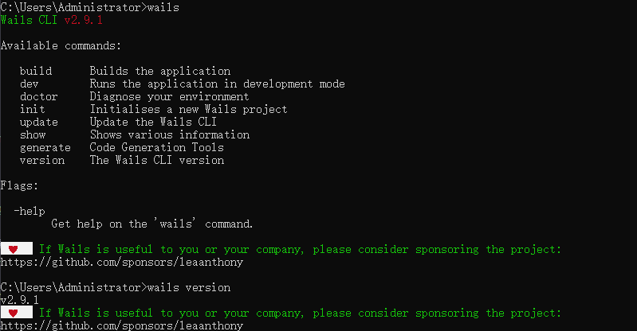

# GO-AUTO
一个开箱即用，基于 robot-go 实现的录制键鼠操作，并回放键鼠操作工具。可以用于游戏、web检查等黑盒自动化测试场景。

# Setup
在release中有不同平台的可用安装包, 根据操作系统的不同下载并安装不同的包体即可

如果需要独自编译源码,请根据以下步骤：

## Required

1. 安装gcc环境
   安装 [llvm-mingw](https://github.com/mstorsjo/llvm-mingw/releases/tag/20240619) 或者 [mingw-w64](https://www.mingw-w64.org/)
      
   1.1 配置环境变量
   获取llvm-mingw / mingw-w64 安装路径,配置到环境变量Path中. example: C://User/llvm-mingw/bin
      
   1.2 验证是否安装成功, 打开cmd / powershell, 输入gcc -v 当看到类似以下的输出时则证明安装成功.
   
      ```shell
        gcc -v
      ```
   

2. 安装Golang.
   可以直接参考官网的安装方式, 这里就不赘述了 [GoLang](https://go.dev/dl/)
   
   2.1 验证golang是否安装成功, 打开cmd / powershell, 输入go version， 当看到以下输出时，既证明安装成功。
   
      ```shell
      go version
      ```

      
   
3. 安装Wails 
   详情也可以参考一下官网的安装方式[Wails](https://wails.io/docs/gettingstarted/installation)

   3.1 验证wails是否安装成功, 打开cmd / powershell, 输入wails / wails version， 当看到以下输出时，既证明安装成功。
   ```shell
      wails version
   ```
      

## 运行项目
   当你把上述必要步骤都配置好之后, 克隆当前仓库到本地中
   ```shell
      git clone https://github.com/tsqqqqqq/go-auto.git
   ```
   
   完成之后，进入到项目目录中运行项目
   ```shell
      wails dev
   ```

## 构建项目
   可以在项目的根目录中使用wails的打包命令来编译、打包项目.

   ```shell
      # 面安装包
      wails build 
      # 使用nsis作为安装启动器
      wails build --nsis
      # 构建debug包
      # 1. 在main。go中，设置LogDebug为Debug。
      # 2. 执行命令wails build --debug
      wails build --debug
   ```